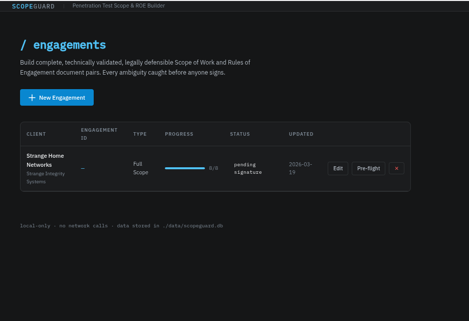
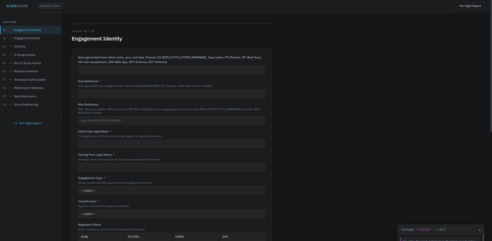

****THIS IS A WORK IN PROGRESS****
-----DO NOT RUN SETUP.SH MORE THAN ONCE ----
The application does not check for an existing database at the moment, which means it will not migrate data either.
It causes existing /engagements to not be removable unless you manually edit the database.
That is in the list of *TODO*
That should be the next implementation. 

# ScopeGuard v2.0
**Penetration Test Scope & Rules of Engagement Builder**

This aims to be a local-only Flask application that guides penetration testing teams through building validated, legally defensible Scope of Work (SOW) and Rules of Engagement (ROE) documents. Every field is validated before a document can be generated. Every ambiguity is caught before anyone signs. Currently it does call out to Google for fonts upon launch but after that there are no others.

---

## Quick Start

```bash
git clone https://github.com/0x4E4558/scopeguard.git
cd scopeguard
bash setup.sh     # creates .venv, installs dependencies
bash run.sh       # starts at http://127.0.0.1:5000
```

**Requirements:** Python 3.10+ · No internet connection required · Data stored locally in `./data/scopeguard.db`

---

## Screenshots

**Engagement intake form — technique authorization matrix**



**Pre-flight report — findings grouped by severity before document generation**



---

## What It Produces

Two `.docx` documents per engagement, with classification headers and page-numbered footers on every page:

**Scope of Work (SOW)**
- Engagement overview, identification, period
- Full contact roster with roles and source IPs
- In-scope asset table — device type, CIDR, VLAN, IP, hostname, MAC, OS, delivery status
- Out-of-scope exclusion table with third-party emergency contacts
- Per-location physical testing activity checklists
- PCI-DSS Cardholder Data Environment scope decision (when applicable)
- Deliverables schedule, data governance, eight legal clauses, signature blocks

**Rules of Engagement (ROE)**
- Communication protocols and critical finding escalation procedures
- Technique authorization matrix with MITRE ATT&CK, NIST 800-115, and PTES mappings
- Maintenance window schedule with IDS/IPS and SOC status per window
- Pre-window confirmation checklists
- Prohibited actions, evidence collection standards, framework appendix
- Safe harbor clause and emergency suspension protocol

---

## Sample Document Output

The two `.docx` files in this repository (`03172026-SIS-001-Scope-of-Work.docx` and `03172026-SIS-001-Rules-of-Engagement.docx`) are real output from ScopeGuard. Below is a cutaway of each.

### Scope of Work (SOW) — document structure

```
┌─────────────────────────────────────────────────────────────────────────────┐
│  PENETRATION TEST                                                           │
│  SCOPE OF WORK & AUTHORIZATION AGREEMENT                                   │
│                                                                             │
│  NOTICE: This document contains sensitive security information.             │
│  STANDARDS ALIGNMENT: MITRE ATT&CK Enterprise v15 · NIST SP 800-115 ·     │
│  PTES · OWASP Testing Guide v4.2 · CVSS v3.1 · CVE/NVD · CWE             │
├─────────────────────────────────────────────────────────────────────────────┤
│  1. Engagement Overview                                                     │
│     1.1 Purpose and Authorization                                           │
│         Written authorization satisfying the CFAA "authorization" element.  │
│         No testing may begin before full execution of this Agreement.       │
│     1.2 Engagement Identification  [table: ID · Type · Classification]      │
│     1.3 Engagement Period          [table: Start · End · Retest window]     │
├─────────────────────────────────────────────────────────────────────────────┤
│  2. Client and Testing Team Contacts                                        │
│     2.1 Client Authorized Representatives   [table: role · name · contact] │
│     2.2 Testing Team Personnel              [table: role · name · src IPs] │
├─────────────────────────────────────────────────────────────────────────────┤
│  3. Scope Definition                                                        │
│     3.1 In-Scope Networks and Hosts                                         │
│         [table: asset name · device type · CIDR · VLAN · IP ·              │
│                hostname · MAC · OS · delivery method · status]              │
│         UNDISCLOSED DEVICE DISCLAIMER included.                             │
│     3.2 Explicitly Out-of-Scope Assets                                      │
│         [table: asset · exclusion reason · third-party contact]             │
│     3.3 Physical Locations In Scope                                         │
│         Per-location authorized activity checklist (17 activities):         │
│         Tailgating Entry · Badge Cloning · Badge Access Testing ·           │
│         Dumpster Recon · Server Room · Network Closet · Workstation ·       │
│         USB Drop · Social Engineering · Camera Bypass · Lock Bypass ·       │
│         Visitor Policy · Clean Desk · Equipment Labeling · DC Cage ·        │
│         SOC Access · Rooftop AP Enumeration                                 │
│     3.4 Social Engineering Scope   [vectors · exclusion list]               │
│     3.5 PCI-DSS CDE Scope Decision [when PCI-DSS is in regulatory basis]   │
├─────────────────────────────────────────────────────────────────────────────┤
│  4. Deliverables                   [table: deliverable · due date]          │
├─────────────────────────────────────────────────────────────────────────────┤
│  5. Data Governance                                                         │
│     AES-256 encryption required · No personal devices · No cloud storage   │
│     Credential reporting ≤ 4 hours · PII documented by type only           │
│     Secure deletion within retention window · Written deletion confirmation │
├─────────────────────────────────────────────────────────────────────────────┤
│  6–9. Legal Clauses                                                         │
│     7. Authorization & Lawful Access (CFAA / 18 U.S.C. § 1030 defense)     │
│     8. Law Enforcement Contact & Client Intervention Obligation             │
│        (Coalfire/Iowa protection — client must confirm authorization        │
│         to detaining authority and provide certified copy on request)       │
│     9. Indemnification                                                      │
│    10. Limitation of Liability (mutual; carve-outs for gross negligence)    │
│    11. Findings Validity — point-in-time disclaimer                         │
│    12. Confidentiality — 5-year survival; indefinite for trade secrets      │
│    13. Governing Law                                                        │
│    14. Entire Agreement                                                     │
├─────────────────────────────────────────────────────────────────────────────┤
│  Signature Blocks   [Authorizing Executive · Engagement Lead]               │
└─────────────────────────────────────────────────────────────────────────────┘
```

### Rules of Engagement (ROE) — document structure

```
┌─────────────────────────────────────────────────────────────────────────────┐
│  RULES OF ENGAGEMENT                                                        │
│  PENETRATION TEST OPERATIONAL PROCEDURES AND CONSTRAINTS                    │
│  Companion document to SOW [EngagementID]-Scope-of-Work.docx               │
├─────────────────────────────────────────────────────────────────────────────┤
│  1. Communication Protocols                                                  │
│     1.1 Daily Operational Communication                                     │
│         Engagement lead sends daily activity summary via encrypted email.   │
│     1.2 Critical Finding Notification — 4-Hour Rule                         │
│         Triggers: unauthenticated RCE · PII access · auth bypass ·         │
│                   financial loss risk · active intrusion · prod impact      │
│         Method: phone to Client CISO, then encrypted email within 1 hour.  │
│     1.3 Emergency Test Suspension conditions and reporting obligations       │
├─────────────────────────────────────────────────────────────────────────────┤
│  2. Technique Authorization Matrix                                           │
│     [table per category — Technique · ATT&CK ID · Phase · Status ·         │
│                            Conditions · Approval · Window · Notification]  │
│                                                                             │
│     Categories: Reconnaissance · Vulnerability Scanning · Exploitation ·   │
│                 Post-Exploitation · Denial of Service ·                     │
│                 Social Engineering · Physical                               │
│                                                                             │
│     Status values: AUTHORIZED · CONDITIONAL · NOT AUTHORIZED               │
├─────────────────────────────────────────────────────────────────────────────┤
│  3. Prohibited Actions (Absolute — 11 items)                                │
│     No access to actual customer data · No financial transactions ·         │
│     No encryption/destruction of data · No persistent backdoors ·           │
│     No log tampering · No zero-day exploitation · No third-party targeting  │
│     No property damage · No testing after stop-work · No unlisted src IPs  │
│     No disclosure to third parties without written client consent           │
├─────────────────────────────────────────────────────────────────────────────┤
│  4. Maintenance Windows            [table: date · window · IDS · SOC]       │
│     Pre-window confirmation checklist per window                            │
├─────────────────────────────────────────────────────────────────────────────┤
│  5. Evidence Collection and Handling                                        │
│     5.1 Required Standards: timestamp · hostname · full output · chain      │
│     5.2 Storage: AES-256 · no personal devices · secure deletion 120 days  │
├─────────────────────────────────────────────────────────────────────────────┤
│  6. Framework References (Appendix A)                                       │
│     MITRE ATT&CK Enterprise v15 · NIST SP 800-115 · PTES ·                │
│     OWASP Testing Guide v4.2 · CVSS v3.1 · CVE/NVD · CWE                 │
├─────────────────────────────────────────────────────────────────────────────┤
│  7. Scope of Authorization — Safe Harbor (5-element checklist)              │
│     Activity must satisfy ALL:                                              │
│       ✓ Targets only assets in SOW Section 3                               │
│       ✓ Conducted within authorized testing window                         │
│       ✓ Originates from listed source IPs (network techniques)             │
│       ✓ Not listed among Prohibited Actions                                │
│       ✓ Conditional techniques: approval workflow completed first           │
├─────────────────────────────────────────────────────────────────────────────┤
│  8. Immediate Suspension & Incident Response                                │
│     Triggers for immediate stop + notification                              │
│     Detention guidance: remain calm · present physical copy of agreement ·  │
│     do not answer questions without counsel                                 │
│     Written incident report within 2 business hours                        │
├─────────────────────────────────────────────────────────────────────────────┤
│  9. Signatures & Team Acknowledgment                                        │
│     [table: name · role · signature · date — all testing team members]     │
└─────────────────────────────────────────────────────────────────────────────┘
```

---

## Sections

### 01 — Engagement Identity
- **Engagement Type** — visible button selection: External · Internal · Web App · Full Scope · Red Team · Vulnerability Assessment
- **Classification** — visible button selection: Confidential · Restricted · Internal · Public
- **Engagement ID** — auto-generated from client name + year + type code (`MCB-2026-PT-000001`)
- **SOW Reference** — auto-generated as `SOW-[ENGAGEMENT_ID]`
- **MSA Reference** — format guidance: `MSA-[CLIENT]-[YYYY]-[NNNNNN]`
- **PCI-DSS** — when selected in regulatory basis, CDE scope decision fields appear immediately

### 02 — Engagement Period
- All dates use `YYYY-MM-DD` format with browser date picker
- Testing hours use 24-hour structured dropdowns (HH : MM : TZ) at 15-minute intervals
- Timezone required for all time fields

### 03 — Contacts
Role picker shows all required and optional roles for your engagement type. Required roles missing will block document generation.

| Always Required | Conditional |
|---|---|
| Authorizing Executive | Physical Security Manager (Full Scope / Red Team) |
| Engagement Lead | Attorney of Record (when SE is authorized) |
| Primary Technical Contact | |
| Emergency Halt Authority | |

Attorney of Record requires: bar number, licensed jurisdiction(s), and law firm name.

### 04 — In-Scope Assets
One card per network segment, VLAN, or device group.

- **Device Type** — multiselect (25 options: NGFW, IDS/IPS, Router, Switch, Application Server, Database Server, Workstation, Laptop, IoT, Smart Appliance, etc.)
- **VLAN ID** — for VLAN-scoped entries; endpoint devices documented within this entry
- **CIDR / Subnet Mask** — validated and cross-checked for agreement
- **IP / Hostname / MAC Address** — for client-provisioned specific devices
- **OS / Platform** — firmware, OS version
- **Delivery Method** — Network Discoverable · Client Provisioned · Physical Access
- **30-Day Notice Acknowledgment** — required checkbox confirming client will deliver a complete, labeled asset inventory no later than 30 days before test initiation

> **Undisclosed Device Disclaimer** — The testing firm is not responsible for devices not disclosed prior to test initiation. Undocumented devices left dysfunctional after testing are the client's sole responsibility to repair.

### 05 — Out-of-Scope Assets
Same device fields as in-scope, plus:
- **Exclusion Reason** — mandatory, specific
- **Third-Party Contact** — when third-party operated: operator name, 24/7 security contact name, and direct phone number (immediately usable if accidental contact occurs)
- **Regulatory Exclusion** — flags Federal Reserve, SWIFT, PCI QSA boundary

### 06 — Physical Locations
One card per facility, pre-expanded for immediate use.

**Authorized Activities** — 17-item guided checklist. Select all activities authorized at *this specific location* — unselected activities are not authorized:

Tailgating Entry · Badge Cloning · Badge Access Testing · Dumpster Reconnaissance · Server Room Access · Network Closet Access · Workstation Physical Access · USB Device Planting · Social Engineering of Staff · Camera Bypass Attempt · Lock Bypass (Non-Destructive) · Visitor Policy Testing · Clean Desk Audit · Equipment Labeling Review · Data Center Cage Access · SOC Access Attempt · Rooftop AP Enumeration

Plus: pre-notification requirements, third-party facility security contact.

### 07 — Technique Authorization
A categorized matrix of **50 techniques** across **7 categories**. Click a category to expand it. Click any technique row to select it — the authorization fields appear inline below that row.

| Category | Techniques |
|---|---|
| Reconnaissance | Passive OSINT, DNS Enum, Port Scanning, Service Detection, AD Enum, SMB/SNMP Enum, Email Harvesting |
| Vulnerability Scanning | Authenticated/Unauthenticated Scanning, Web App Scanning, SSL/TLS Analysis, Database Scanning |
| Exploitation | RCE, SQLi, XSS, Auth Bypass, Session Hijacking, XXE, Deserialization, SSRF, LFI/RFI, Password Spraying, Credential Stuffing, Brute Force |
| Post-Exploitation | Kerberoasting, AS-REP Roasting, PtH, PtT, NTLM Relay, Priv Esc, Lateral Movement, Persistence, Credential Dumping, C2, Data Exfil Simulation |
| Denial of Service | Application-Layer, Network-Layer, Resource Exhaustion |
| Social Engineering | Phishing, Vishing, Smishing, USB Drop, Impersonation, Spear Phishing |
| Physical | Tailgating, Badge Cloning, Dumpster Recon, Lock Bypass, Workstation Access, Drop Device Installation |

For each selected technique: Authorization Status (Authorized / Conditional / Not Authorized), conditions text, approval workflow, maintenance window reference, advance notification lead time and recipient, scope limitation.

### 08 — Maintenance Windows
- Date, start/end time with 24h timezone dropdowns
- Pre-notification hours and recipient contact
- Authorized techniques for this window
- **IDS/IPS confirmation** — active status and whitelist status
- **SOC notification** — confirmed before testing proceeds
- Pre-start checklist items (shown to operator before window opens)

### 09 — Data Governance
Credential reporting window (≤ 4 hours), PII handling, evidence encryption, retention period, deletion confirmation, third-party disclosure prohibition (mandatory), cloud storage and personal device restrictions.

### 10 — Social Engineering
Applies when SE vectors are authorized in Techniques. All employees are in scope by default unless explicitly excluded.

- **Phishing** — target departments and client list delivery date required
- **Vishing** — target scope required
- **Impersonation** — approved pretexts required
- **USB Drop** — payload type required (inert / macro / executable)
- **Exclusion List** — explicitly list anyone excluded from SE testing

---

## Pre-Flight Report

Available at any time. Findings are classified:

| Severity | Meaning |
|---|---|
| **BLOCK** | Document cannot be generated until resolved |
| **CLARIFY** | Legal exposure risk — resolve before signing |
| **MISSING** | Required field not yet filled |
| **NOTE** | Advisory — verify intentionality |

---

## Validation Rules

### Field-Level (VAL-001 – VAL-021)
CIDR validity and mask agreement · VLAN count consistency · Date ordering (start/end, draft/final) · Testing hour ordering · Tester IP format · Email format · Conditional technique requirements · Maintenance window references · Credential reporting window · Third-party disclosure · USB executable authorization · Signature completeness · Required contact roles per engagement type · Client-provisioned asset delivery · Full-scope physical location requirement · SE exclusion list · Phishing sub-fields · Vishing/Impersonation/USB sub-fields · Maintenance window activities · Physical location notification fields

### Cross-Reference (XRF-001 – XRF-016)
CIDR overlap · Subnet containment · Maintenance window technique references · Window dates within engagement period · Notification recipient resolution · Retest window bounds · Blackout date bounds · Physical security manager contact · Attorney of Record contact · Third-party facility notification · Notification lead time definitions · Supernet overlap · Tester source IPs for network techniques · HIPAA declaration · PCI-DSS CDE scope decision

---

## Legal Protections Built In

**SOW:** Authorization/CFAA defense · Law Enforcement Contact & Client Intervention Obligation (Coalfire/Iowa protection) · Indemnification · Limitation of Liability · Findings Validity (point-in-time) · Confidentiality/NDA · Governing Law · Entire Agreement

**ROE:** Scope of Authorization Safe Harbor (5-element checklist) · Immediate Suspension & Detention Guidance

---

## Running Tests

```bash
python3 run_tests.py
```

**124 tests** — 0 failures required before shipping any engagement.

Coverage: All 23 field-level rules · All 16 cross-reference rules · Form builder field types · Technique catalog schema integrity · Physical location activity options · Document generation content · Route integration for all 10 sections + preflight + document generation · 3 milestone tests

---

## Architecture

```
.
├── app/
│   ├── __init__.py          # Flask routes
│   ├── form_builder.py      # Schema → UI field specs
│   ├── generator.py         # Engagement → .docx
│   ├── hydrator.py          # JSON → Engagement model
│   ├── legal.py             # Legal clause library
│   ├── storage.py           # SQLite store
│   ├── templates/
│   │   ├── base.html        # Layout shell (DM Sans + JetBrains Mono)
│   │   ├── section.html     # All intake forms + technique matrix
│   │   ├── preflight.html   # Validation report
│   │   └── index.html       # Engagement list
│   └── static/
│       ├── css/app.css      # Design system (steel blue, warm charcoal)
│       └── js/form.js       # Auto-save, conditionals, list management
├── schema/                  # YAML field definitions — source of truth
│   ├── engagement.yaml      # Identity, classification, CDE scope
│   ├── period.yaml          # Dates, hours, blackouts
│   ├── contacts.yaml        # Roles, credentials, source IPs
│   ├── assets.yaml          # In-scope, out-of-scope, physical locations
│   ├── techniques.yaml      # 50-technique catalog, 7 categories
│   ├── maintenance_windows.yaml
│   ├── data_governance.yaml
│   └── social_engineering.yaml
├── scopeguard/              # Validation engine (no Flask dependency)
│   ├── models.py            # Engagement dataclasses
│   ├── validator.py         # All VAL + XRF rules
│   ├── finding.py           # Finding, FindingList, Severity
│   └── schema_loader.py
├── tests/
│   ├── conftest.py          # Fixture loader + pytest fixtures
│   ├── test_field_rules.py  # VAL-001 through VAL-020
│   ├── test_xref_rules.py   # XRF-001 through XRF-016
│   ├── test_v2_features.py  # v2 features (pytest)
│   └── fixtures/
│       ├── mcb.json         # Canonical valid engagement (Meridian Community Bank)
│       └── nexus_bad.json   # Deliberately broken engagement (Nexus Plaza)
├── run_tests.py             # Standalone runner — no pytest required
├── setup.sh                 # First-time setup
└── run.sh                   # Start application
```

---

## Data & Privacy

All data is stored locally in `./data/scopeguard.db` (SQLite). No network connections are made at runtime. No data leaves your machine. The Google Fonts stylesheet is loaded from the internet on first page load — replace the `@import` in `app.css` with locally hosted fonts if offline operation is required.

---

## Version History

**v2.0** — March 2026
- Technique section rebuilt as a 50-technique / 7-category matrix — select all at once, no repetitive card creation
- Engagement type and classification changed to visible button groups
- Device type changed to multiselect in in-scope and out-of-scope sections
- Physical location activities changed to 17-item guided multiselect checklist — per location
- CDE scope decision field added to identity section for PCI-DSS engagements
- Client asset 30-day delivery acknowledgment added to in-scope assets
- Third-party emergency contacts added to out-of-scope asset records
- Time fields rebuilt as structured 24-hour dropdowns with timezone
- Engagement ID and SOW reference auto-generated
- Document headers/footers on every page (classification, page N of M, version)
- 124 tests (up from 92)

**v1.0** — January 2026
- Initial release: validation engine, intake form, pre-flight report, document generation
